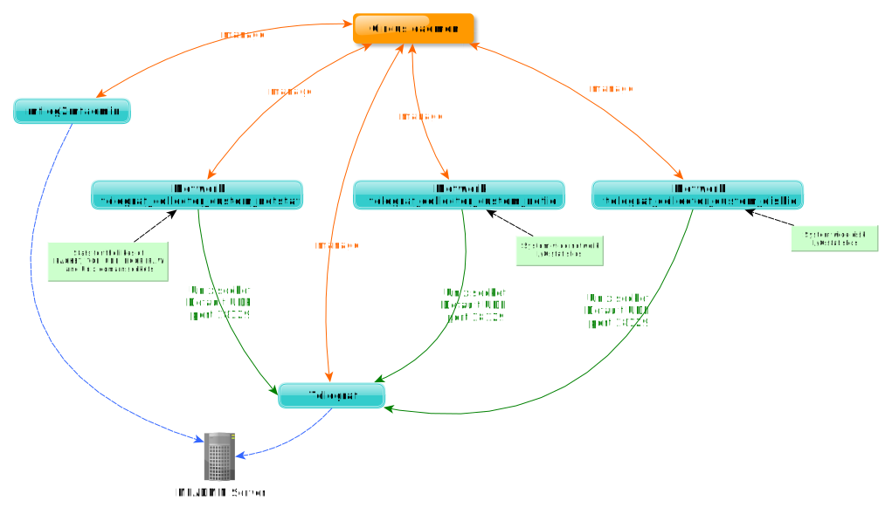

# Introduction to MFSYSMON

## What is mfsysmon?

MFSYSMON is a Metwork module which contains **tools and libraries** used to monitor the overall resources of the operating system on which Metwork is running.

.. index:: MFADMIN module,telegraf
## How it works?

MFSYSMON collects the following metrics:
- disk I/O statistics
- network information and I/O statistics

The retrieved metrics are sent to [telegraf server agent](https://www.influxdata.com/time-series-platform/telegraf/) through an unix socket (see [Metwork telegraf-unixsocket-python-client](https://github.com/metwork-framework/telegraf-unixsocket-python-client) for more details).

[Circus](https://circus.readthedocs.io/en/latest/) is a Python program in order to monitor and control processes and sockets.

[Telegraf](https://docs.influxdata.com/telegraf/) is a plugin-driven server agent for collecting and sending metrics and events from databases, systems, and IoT sensors.

[StatsD](https://github.com/statsd/statsd)is a simple protocol for sending application metrics via UDP.

Circus acts as a process watcher and runner. You may check the full `circus.ini` configuration file in the `/home/mfsysmon/tmp/config_auto/` directory. Check the [Circus architecture](https://circus.readthedocs.io/en/latest/design/architecture/)

:index:`Dashboards` are available through :doc:`The MFADMIN module <mfadmin:index>`.

.. seealso::
    | `Sending StatsD Metrics to Telegraf & InfluxDB <https://www.influxdata.com/blog/getting-started-with-sending-statsd-metrics-to-telegraf-influxdb/>`_
    | `Telegraf StatsD input plugin <https://github.com/influxdata/telegraf/tree/master/plugins/inputs/statsd>`_ 

<!--
Intentional comment to prevent m2r from generating bad rst statements when the file ends with a block .. xxx ::
-->
